<a id="readme-top"></a>

<h1 align="center"> React Team Project WDP-2304-02</h1>

<h4 align="center">Bazar Online Shopping website created as part of the Kodilla Bootcamp team project.</h4>

<p align="center">
  <a href="#demo">Demo</a> •
  <a href="#overview">Quick overview</a> •
  <a href="#languages">Languages&Tools</a> •
  <a href="#how-to-use">How To Use</a> •
  <a href="#contact">Contact</a>
</p>

<p align="center">
  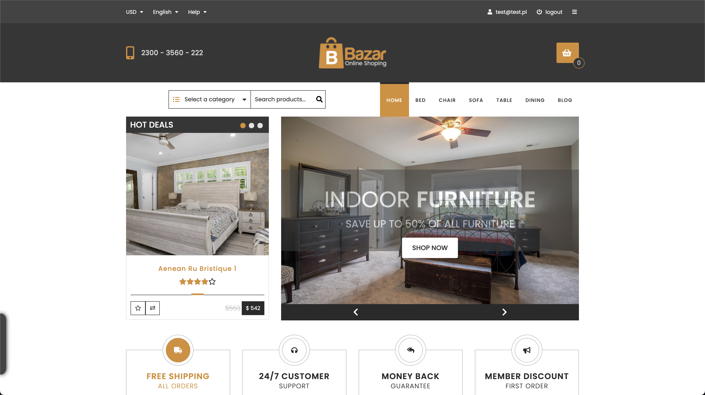
<p>

## 💻 <a id="demo">Demo :</a>

If you want check Product Personalizer App, it is deployed on Netlify. Just click link below :<br />

https://wdp2304-02.netlify.app/

<p align="right">(<a href="#readme-top">back to top</a>)</p>

## 🚀 <a id="overview">Quick overview :</a>

I had the opportunity to become a member of a team of five Junior Developers and a Project Manager who supervised the project. The project included three weeks of work. During this time, my main tasks were :

- Correcting errors and developing the project, which was the website of an online store with furniture in its offer.
- Constant communication with other team members and verification code of others before the final merge to the main branch.

The basis of communication in the project was a team group chat, in which we exchanged notes and talked about problems encountered during the implementation of tasks. Jira was a project support and management system. The Project Manager was responsible for the availability of new tasks. GitHub was the version control system for the project we were working on. Each developer working in a team could assign a maximum of two tasks in Jira (one in the "queued" column and one he was working on). After finishing work on the code, the Project Manager and other developers verified the correctness of the code. After receiving at least two approvals, the pull request was merged into the main branch.

During work in team project, I have finished the following tasks:

<details>
  <summary>
    <b>🐞 Bug Fix :</b> Correct styles for .cartCounter selector.
  </summary>
  <div>
    <samp>
      <h2 align="center">Correct styles for .cartCounter selector:</h2>

#### Task description:

When larger number is displayed, e.g. 123, the element behaves badly. Correct it so that it allows displaying numbers in the range 0-99999 (max. 5 digits).

  <p align="center">
    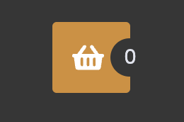
    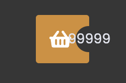
  </p>

#### What I did:

I set alternative styles for the `.cartCounter` selector. Adding `width: fit-content` would be enough. But I decided to add an additional orange border color and `8.5px padding` - with single numbers, border looks more rounded. I changed the color of the number - in the future it will improve the possibility of making global changes.

  <p align="center">
    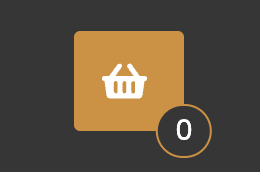
    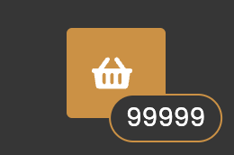
  </p>
    </samp>
  </div>
</details>

<details>
  <summary>
    <b>🐞 Bug Fix :</b> Display "Quick view" and "Add to cart" buttons on product hover.
  </summary>
  <div>
    <samp>
      <h2 align="center">Display "Quick view" and "Add to cart" buttons on product hover:</h2>

#### Task description:

The "Quick view" and "Add to cart" buttons should be visible only on the hover of the entire box with the product. Then the background of the price should also change.

#### What I did:

I added a new declaration `visibillity: hidden` for `.buttons` selector. After hovering ProductBox component:

- Visibility property changes value to visible,
- Price button changes its background color to orange.

What is important visible buttons don't change height of ProductBox component.

<p align="center">
  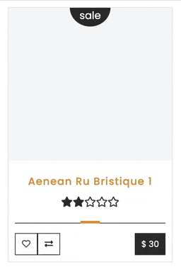
</p>
    </samp>
  </div>
</details>

<details>
  <summary>
    <b>🐞 Bug Fix :</b> Buttons "favorite" and "compare" have no styles for active states.
  </summary>
  <div>
    <samp>
      <h2 align="center">The "favorite" and "compare" buttons have no styles for active states:</h2>

#### Task description:

The "favorite" and "compare" buttons have no styles for active states.

#### What I did:

In `InitialState` file, I added a new keys for each product: `favorite` and `compare`. They can handle boolean values. I created styles for active "favorite" and "compare" buttons. Favorited or compared product has a colored and scaled symbol. For example, the following code is responsible for styling a button for product which has favorite value seted on true: `className={favorite && styles.favorite}`.

<p align="center">
  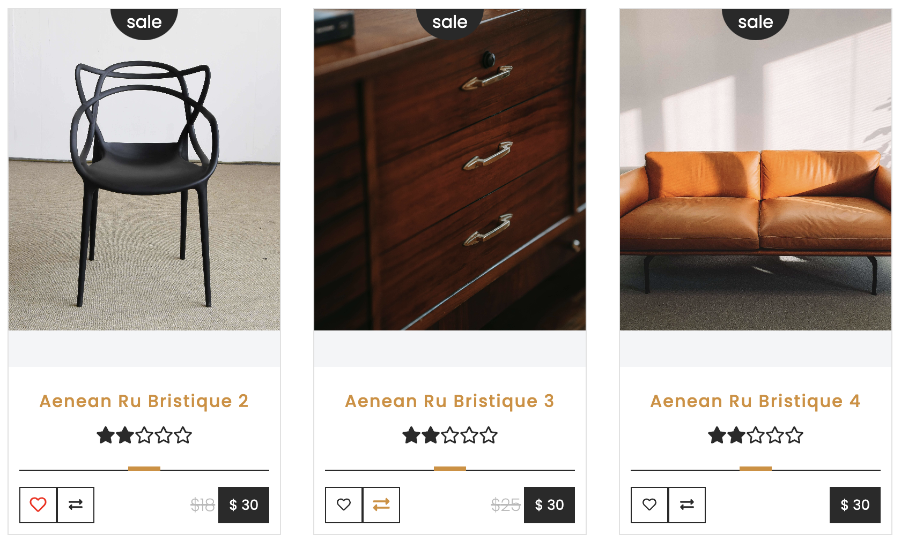
</p>
    </samp>
  </div>
</details>

<details>
  <summary>
    <b>⚙️ Feature :</b> Functionality of toggling favorite product.
  </summary>
<div>
  <samp>
    <h2 align="center">Functionality of toggling favorite product:</h2>

#### Task description:

Each product card has a button to mark the product as a favorite. Currently, this button has no functionality. It should display in the application store that this product is a favorite.

#### What I did:

I added functionality of toggling product favorite value. From now on toogling the favorite button affects the state of the application. After using react-redux hook (useDispatch) I had to make some changes in Jest tests of ProductBox - I had to wrapped Product box in Provider. Button changes it's background-color on orange for favorite products.

<p align="center">
  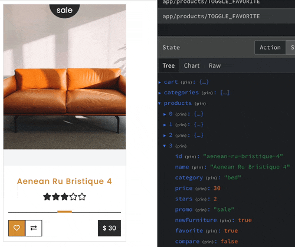
</p>
    </samp>
  </div>
</details>

<details>
  <summary>
    <b>⚙️ Feature :</b> Functionality of toggling up to 4 compared products.
  </summary>
  <div>
    <samp>
      <h2 align="center">Functionality of toggling up to 4 compared products:</h2>

#### Task description:

Each product card has a button to mark the product as a compared. Currently, this button has no functionality. It should display in the application store that this product is a compared. Up to four products can be selected as compared! If you try to add another one, ignore the click.

#### What I did:

I added functionality of toggling product compare value. From now on toogling the compare button affects the state of the application. After using react-redux hook (useDispatch) I had to make some changes in Jest tests of ProductBox - I had to wrapped Product box in Provider. Button changes it's background-color on orange for compare products. You can add maximum 4 products to comparison.

<p align="center">
  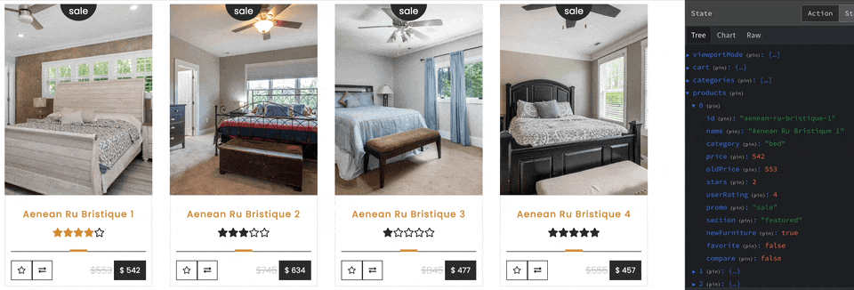
</p>
    </samp>
  </div>
</details>

<details>
  <summary>
    <b>⚙️ Feature :</b> Create a sticky bar on the bottom of the viewport.
  </summary>
  <div>
    <samp>
      <h2 align="center">Create a sticky bar on the bottom of the viewport:</h2>

#### Task description:

Create a sticky bar at the bottom of the viewport with photos of selected products next to each other. On the hover, a close icon is supposed to appear on the photo, and clicking on the photo removes that product from the comparison. There is supposed to be a "Compare" button next to the products (for now it's supposed to do nothing).

#### What I did:

I created a sticky bar on the left bottom of the viewport. Hovering over a sticky bar will cause it to slightly extend towards the center of the viewport. When You click on Sticky bar it will expand to show all the products added to the comparison. The width of the sticky bar depends on the number of products added to the comparison. The compared product, which is on the sticky bar, has a fully functional `X` mark on the right bottom corner. You can remove product from the comparison by clicking on the `X` mark that appears after hovering over the compared product.

<p align="center">
  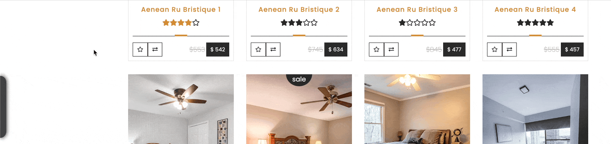
</p>
    </samp>
  </div>
</details>

<details>
  <summary>
    <b>⚙️ Feature :</b> Add fade animation on switching tabs and pages on New Furniture section.
  </summary>
  <div>
    <samp>
      <h2 align="center">Add fade animation on switching tabs and pages on New Furniture section:</h2>

#### Task description:

The "New furniture" section has categories ("Bed", "Chair", etc.) which, when clicked, changes the set of visible products. At the beginning, it would be worth adding some sample products so that there are also some in other categories.
The client would like an animation of switching between tabs and pages (pagination with dots to the right of tabs-categories). Some class is to be added for the entire component, which will fade-out the products, then it will change the category in the component state and remove this class from the component so that the products will show with fade-in.

#### What I did:

I added product pictures to each section and product objects in `InitialState` file. I created a fade animation which changes the visibility of products during page changing. The animation time was set by the `setTimeout` method to 250 milliseconds.

<p align="center">
  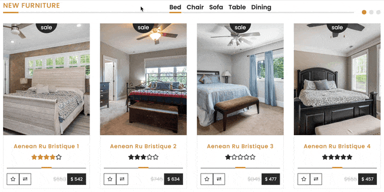
</p>
   </samp>
  </div>
</details>

<details>
  <summary>
    <b>🐞 Bug Fix :</b> Correct ProductBox image display.
  </summary>
  <div>
    <samp>
      <h2 align="center">Correct ProductBox image display:</h2>

#### Task description:

Photos in ProductBox components do not fill all available space. There is still a gray background behind the QuickView and Add to Cart buttons.

#### What I did:

I changed styles of ProductBox images. From now on, the picture fills all available space.

<p align="center">
  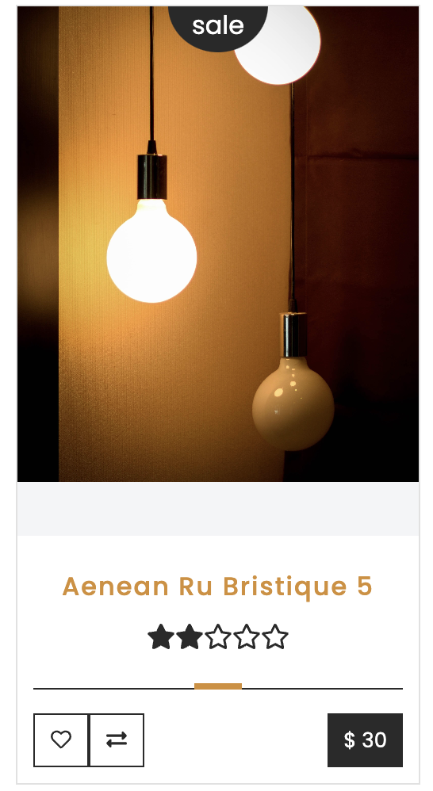
  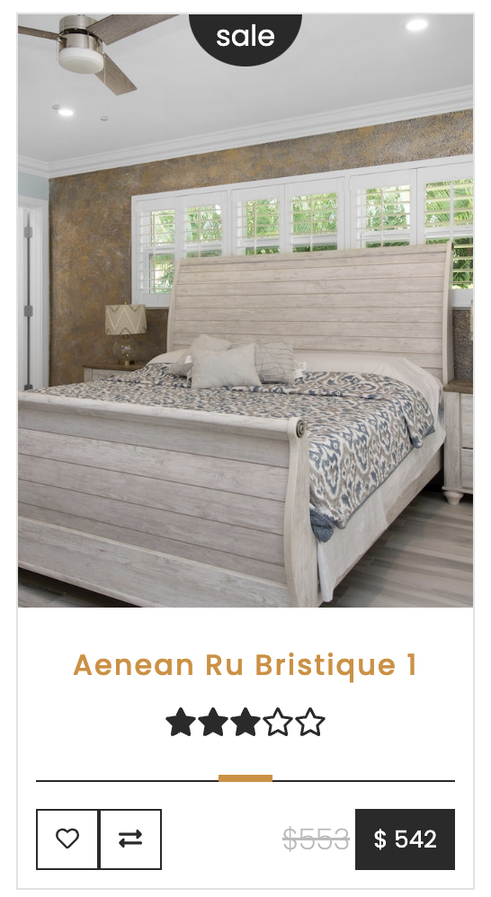
</p>
    </samp>
  </div>
</details>

<details>
  <summary>
    <b>🐞 Bug Fix :</b> Add sale label for only discounted products.
  </summary>
  <div>
    <samp>
      <h2 align="center">Add sale label for only discounted products:</h2>

#### Task description:

Currently, each of the products has a "sale" label. The label should only be visible for discounted products.

#### What I did:

At the beginning, all of ProductBoxes have got sale labels at the top of picture. Some of products have key named `oldPrice`. I used that logic to change code in ProductBox component. I've created a feature to display sale label for those products which has got discounted price.

<p align="center">
  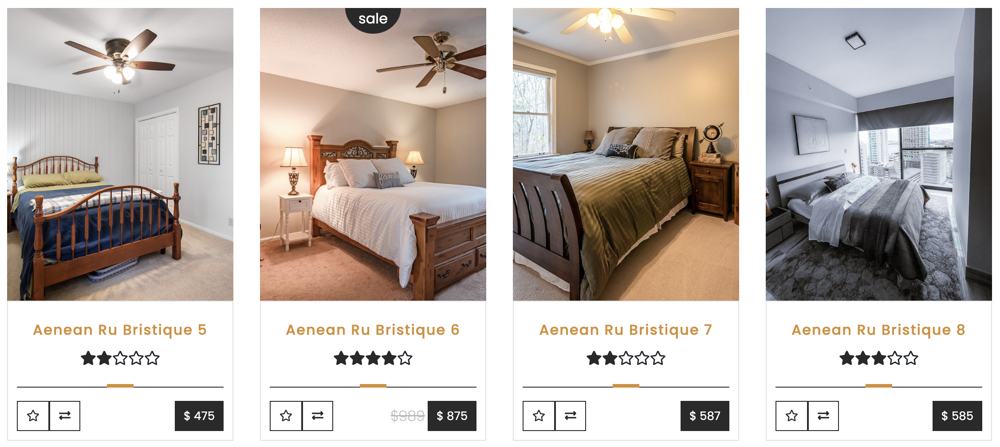
</p>
    </samp>
  </div>
</details>

<details>
  <summary>
    <b>⚙️ Feature :</b> Create a "Promotions" section following the design.
  </summary>
  <div>
    <samp>
      <h2 align="center">Create a "Promotions" section following the design:</h2>

#### Task description:

It's just a plain static section with no functionality. As a part of this task, you need to make a component (or components), style it, and fetch the content from the state of the application. All 3 boxes should be of constant height - even if you use a larger photo in the background of one of them, it should not go beyond the given box or change its size.

#### What I did:

I created a fully styled "Promotions" section right above the new furniture section. All boxes have a constant height. I've created new selector to get those products which old price is higher than actual price. To improve UX, every time you refresh the page list of promotions product will be shuffled. Products are selected from application state. Shuffling products results in a different order of products in the array each time page is refreshed. From now I am using first three products in promotions section. I used ternary operator to show percentage decrease of product price.

<p align="center">
  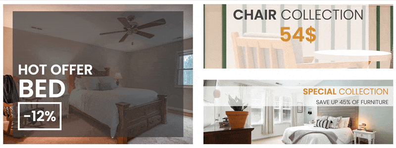
</p>
    </samp>
  </div>
</details>

<details>
  <summary>
    <b>⚙️ Feature :</b> Add RWD for "Promotions" section.
  </summary>
  <div>
    <samp>
      <h2 align="center">Add RWD for "Promotions" section.:</h2>

#### Task description:

Add RWD for "Promotions" section.

#### What I did:

I added RWD for "Promotions" section.
</samp>

  </div>
</details>

<details>
  <summary>
    <b>⚙️ Feature :</b> Create Log In page.
  </summary>
  <div>
    <samp>
      <h2 align="center">Create Log In page:</h2>

#### Task description:

Prepare the login page. The appearance of the page according to your preferences.
After logging in, save the user to session Storage.

#### What I did:

I created LogIn and SignIn Page using one component - AccessPage. AccessPage content depends on the type of URL path, replacing the content on the form with Log In or Sign In context. I created a ProtectedRoute component that protects other Routes from access by a non-logged in user. Furthermore, I added functionality to the icons in the TopBar. So now they navigate to specific paths. I had to upgrade react-router-dom dependency. Logged User data is saved in: DevTools → Application → Session Storage.

<p align="center">
  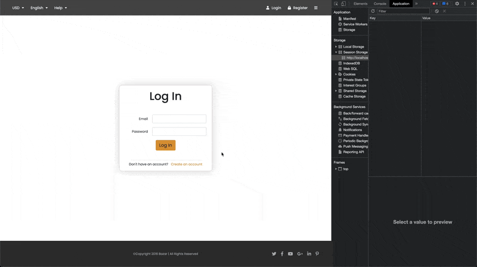
</p>
    </samp>
  </div>
</details>

<details>
  <summary>
    <b>⚙️ Feature :</b> Create modal (popup) with a newsletter subscription form.
  </summary>
  <div>
    <samp>
      <h2 align="center">Create modal (popup) with a newsletter subscription form:</h2>

#### Task description:

Prepare a modal (popup) with a form for subscribing to the newsletter. The modal should appear after 15 seconds of browsing the page or after the user tries to leave the page (after moving the cursor outside the viewport). If the user has subscribed to the newsletter, he should not see this modal a second time.

#### What I did:

I created a feature of popup newsletter modal which displays itself in two ways :

- After 15 sec.
- When user moves mouse out of viewport.

I used react bootstrap modal component to create feature. After saving the address for the newsletter, it will be stored in the Redux store. I set maximum 1 popup of newsletter modal on browser refresh for better UX. Newsletter modal cannot be displayed on : /login or /signin path and when user is already signed to newsletter. You can try in by using one of the test emails below: <br/>test@test.pl, admin@admin.pl, 1@1.pl, 0@0.pl.

<p align="center">
  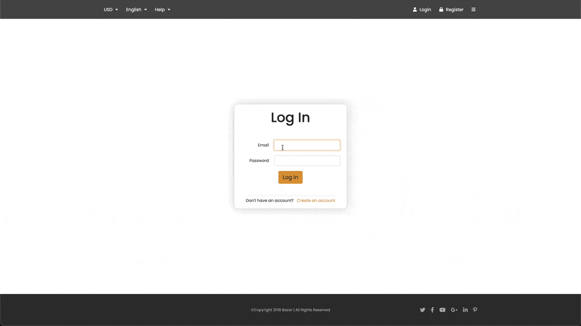
</p>
    </samp>
  </div>
</details>

<details>
  <summary>
    <b>⚙️ Feature :</b> Create product page based on category list.
  </summary>
  <div>
    <samp>
      <h2 align="center">Create product page based on category list:</h2>

#### Task description:

Create a product page based on the list of categories stored in the Redux store.

#### What I did:

I created ProductList component with products sorted by category. ProductBox has grid arrangement in ProductList. NavLinks are based on categories stored in InitialState. Each of the Navlinks has a `onClick` listener that changes the class to active. After clicking on NavLink website changes directory to the specified path. In ProductList component, there is active funcionality of sorting by price and rating with fade animation. In ProductList component, there is active functionality of displaying specified number of elements. By default, ProductList displays at beginning only 8 ProductBoxes. You can expand ProductList by clicking on the button below the products.

<p align="center">
  
</p>
    </samp>
  </div>
</details>

<p align="right">(<a  href="#readme-top">back to top</a>)</p>

## 🛠️ <a id="languages">Languages & tools :</a>

|                                                                   Language / Tool                                                                    | Description                                                                                       |
| :--------------------------------------------------------------------------------------------------------------------------------------------------: | :------------------------------------------------------------------------------------------------ |
|                                         | Language used for structuring and presenting content on the World Wide Web.                       |
|                                          | CSS pre-procesor that make writing CSS more powerful.                                             |
|                 | Icon library instead of traditional image icons.                                                  |
|  | To create dynamically updating content.                                                           |
|                                       | JavaScript library for building user interfaces based on components                               |
|    | Used to start with project App.                                                                   |
|                 | Implements dynamic routing in web applications that allow navigating without refreshing the page. |
|                                       | Serves as a centralized store for state that is used across entire application.                   |
|                                              | JavaScript testing framework designed to ensure correctness of any JavaScript codebase.           |
|                                     | Build and deploy pull requests from Git.                                                          |
|                                           | An agile project management tool that supports in this case kanban methodology.                   |
|                                                                       ShortId                                                                        | Creates short non-sequential unique ids.                                                          |
|                                                                         Clsx                                                                         | Utility for constructing className strings conditionally.                                         |

<p align="right">(<a href="#readme-top">back to top</a>)</p>

## 💾 <a id="how-to-use">How To Use :</a>

```bash
# Clone this repository
$ git clone https://github.com/iMdPd/reactTeamProject.git

# Go into the repository
$ cd random/directory/reactTeamProject

# Install dependencies
$ yarn install

# Run the app
$ yarn start
```

<p align="right">(<a href="#readme-top">back to top</a>)</p>

## 🤙🏻 <a id="contact">Contact :</a>

> GitHub [@iMdPd](https://github.com/iMdPd)
